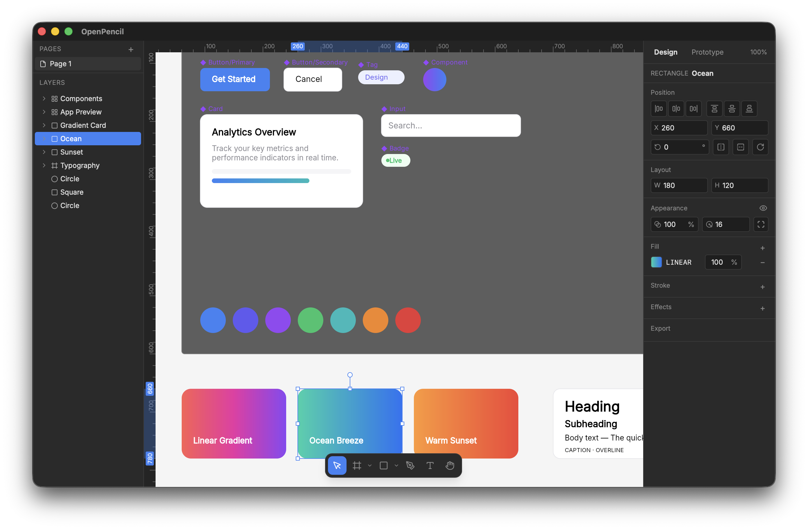

# OpenPencil

Open-source, AI-native design editor. Figma alternative built from scratch with full .fig file compatibility.

> **Status:** Active development. Not ready for production use.



## Features

- **Figma .fig file import** — open native Figma files directly
- **Figma clipboard** — copy/paste between OpenPencil and Figma
- **Vector networks** — complex boolean shapes and open paths, like Figma
- **Auto-layout** — constraint-based layout matching Figma behavior
- **Pen tool** — bezier curves with tangent handles
- **Inline text editing** — multi-line text with Inter font
- **Undo/redo** — all operations are undoable
- **Snap guides** — edge and center snapping
- **Color picker** — HSV, hue/alpha sliders, hex input

## Tech Stack

| Layer | Tech |
|-------|------|
| UI | Vue 3, VueUse, Reka UI |
| Styling | Tailwind CSS 4 |
| Rendering | Skia (CanvasKit WASM) |
| Layout | Yoga WASM |
| File format | Kiwi binary (vendored) + Zstd + ZIP |
| Color | culori |
| Desktop | Tauri v2 |
| Testing | Playwright (visual regression), bun:test (unit) |
| Tooling | Vite 7, oxlint, oxfmt, typescript-go |

## Getting Started

```sh
bun install
bun run dev
```

## Scripts

| Command | Description |
|---------|-------------|
| `bun run dev` | Dev server at http://localhost:1420 |
| `bun run build` | Production build |
| `bun run check` | Lint + typecheck |
| `bun run test` | E2E visual regression |
| `bun run test:update` | Regenerate screenshot baselines |
| `bun run test:unit` | Unit tests |
| `bun run tauri dev` | Desktop app (requires Rust) |

## Desktop App

Requires [Rust](https://rustup.rs/), the Tauri CLI, and platform-specific prerequisites ([Tauri v2 guide](https://v2.tauri.app/start/prerequisites/)).

```sh
cargo install tauri-cli --version "^2"
bun run tauri dev                      # Dev mode with hot reload
bun run tauri build                    # Production build
bun run tauri build --target universal-apple-darwin  # macOS universal
```

Cross-compilation to other platforms requires their respective toolchains or CI (e.g. GitHub Actions).

## Project Structure

```
src/
  components/     Vue SFCs (canvas, panels, toolbar, color picker)
  composables/    Canvas input, keyboard shortcuts, rendering
  stores/         Editor state (Vue reactivity)
  engine/         Scene graph, renderer, layout, clipboard, undo, vector, snap
  kiwi/           Figma file format (Kiwi codec, .fig import)
    kiwi-schema/  Vendored from evanw/kiwi
  types.ts        Shared types
  constants.ts    UI colors, defaults, thresholds
desktop/          Tauri v2 (Rust + config)
tests/
  e2e/            Playwright visual regression
  engine/         Unit tests
```

## License

MIT
